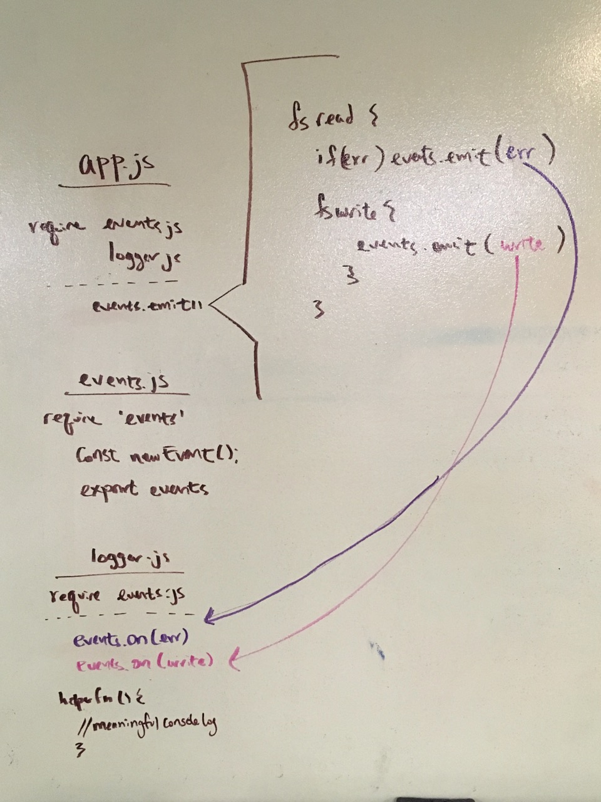

# LAB - 16

## Project Event Driven Application

### Author: Ai

### Links and Resources
* [submission PR](https://github.com/401-advanced-javascript-aimurphy/16-Events/pull/2)
* [travis](http://xyz.com)
* [back-end](http://xyz.com) (when applicable)
* [front-end](http://xyz.com) (when applicable)

#### Documentation
* [api docs](./) (API servers)
* [jsdoc](http://xyz.com) (Server assignments)
* [styleguide](http://xyz.com) (React assignments)

### Modules
#### `event.js`
##### exports events which is an instance of `new Event();`
#### `logger.js`
##### event.on() will be listening for and reacting to any `error` and any `fs.write`.

###### `event.on()`
This is our listener, we are going to create a handler function to be used as a callback for this function

###### `event.emit()`
This is our emitter--it sends out the change that will trigger the listener and it's embedded handler

### Setup
#### `.env` requirements
* no special .env requirements yet.

#### Running the app
* `node app.js`
* Endpoint: `/app/`
  * Runs our fs read and write.

  
#### Tests
* Run tests by running `npm test` in your terminal
* This test is not yet created! So don't try 👆that yet!
* What assertions need to be / should be made?

#### UML

